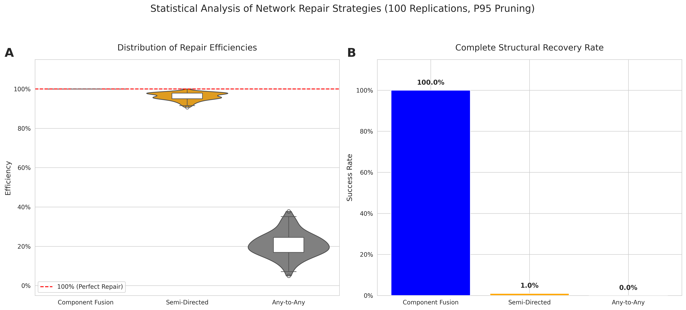

# Optimal Neural Network Repair: Achieving Theoretical Limits in Fragment Recovery via Component Fusion

[](https://orcid.org/0009-0008-1822-3452) [](https://opensource.org/licenses/MIT) []() [](https://doi.org/10.5281/zenodo.1234567)

This repository contains the code, data, and experiments for the research paper "Optimal Neural Network Repair: Achieving Theoretical Limits in Fragment Recovery via Component Fusion".

The project establishes and empirically validates the theoretical limit for neural network repair: the minimum number of connections required to restore structural integrity is exactly equal to the number of fragmented components. Our findings are validated on a large-scale network (850 neurons) under severe damage (85% random pruning) and confirmed with a robust statistical analysis of 100 independent replicas.¹


*Statistical analysis of repair strategies across 100 independent replicas under 85% random pruning, demonstrating the perfect consistency and superiority of Component Fusion.*
¹

## 🎯 Main Contributions
* 🔬 **Validated Theoretical Limit:** We demonstrate that the minimum connections for a complete repair equals the number of fragments ($C_{\text{min}} = F$).¹
* 💯 **Deterministic Reliability:** Our method (Component Fusion) achieved a 100% success rate across 100 replicas, while baselines achieved only 1% and 0%.¹
* 💡 **Resource Optimality:** We achieved perfect repair using 50% fewer connections than baseline strategies, which were given double the budget and still failed.¹
* ⚙️ **Statistical Rigor:** All findings were validated under severe stress conditions (85% random pruning on an 850-neuron network) to ensure robustness.¹

## 🔬 Interactive and Reproducible Experiment
This repository is designed for open science and full reproducibility. You can run the complete pipeline, from network generation to statistical analysis and results visualization, in the following Google Colab notebook.

**Complete Validation Pipeline**
Run the large-scale experiment and the 100-replica robustness test to validate the paper's findings.
[](https://colab.research.google.com/drive/1A0iFu8xn0QZilWM4e1z6e30REQCP8ICO#scrollTo=sBrGZl2PVS5d)

## 📂 Repository Structure
* `Component_Fusion_Experiment.ipynb`: The interactive Colab notebook with all experiments.
* `/data`: Contains the .csv files with the detailed results from the 100 replicas.
* `/figures`: Contains the high-quality figures generated for the paper.
* `LICENSE`: The project's MIT License.
* `README.md`: This file.

## 🔬 Independent and Open Science
This work was conducted completely independently, without institutional or corporate funding, demonstrating that cutting-edge research can also emerge from open and accessible environments. This project is the practical application and empirical validation of the principles explored in the [Topological Reinforcement Operator project](https://github.com/NachoPeinador/Topological-Reinforcement-Operator).

[](https://github.com/sponsors/NachoPeinador)

## 🚀 Support and Share this Research
As an independent researcher, the visibility and impact of this work largely depend on community support. If you found this research useful or interesting, here are a few specific ways to help:

* **⭐️ Star on GitHub:** It's the quickest and most direct way to show your support and help others discover this project.
* **🔄 Share on Social Media:** Post a link to the paper's preprint or this repository on Twitter (X), LinkedIn, or your preferred academic network.
* **✍️ Cite the Work:** If this methodology inspires your own research, citation is the most valuable form of recognition in science.
* **💬 Start a Discussion:** Have ideas, questions, or constructive criticism? Open an "Issue" here in the repository.

**Thank you for your support in making independent science visible!**

## ✍️ Citation
BibTeX Snippet
```bibtex
@article{PeinadorSala2025,
  author    = {Jos\'{e} Ignacio Peinador Sala},
  title     = {Optimal Neural Network Repair: Achieving Theoretical Limits in Fragment Recovery via Component Fusion},
  journal   = {arXiv preprint arXiv:XXXX.XXXXX},
  year      = {2025}
}
